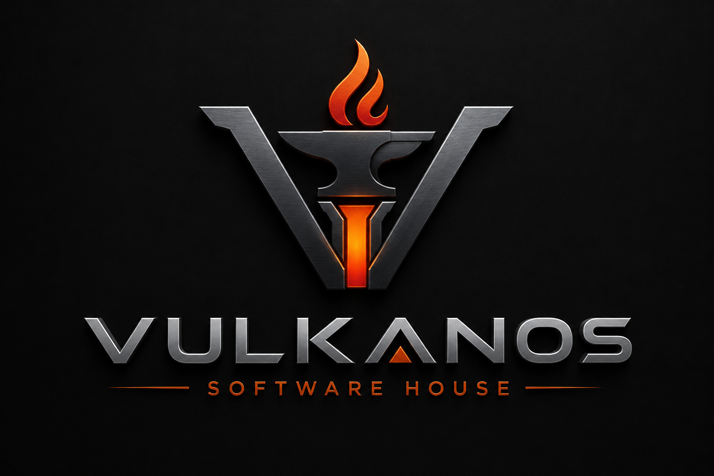

# Vulkanos Software House

> Engenharia de Software de Alta Performance - Portfólio e Currículo Pessoal



## 🚀 Sobre

Vulkanos é uma plataforma moderna de portfólio e currículo pessoal desenvolvida com tecnologias de ponta. Apresenta projetos e habilidades em engenharia de software com um design elegante e responsivo.

**Stack Tecnológico:**
- **Frontend**: HTML5, CSS3, Vanilla JavaScript
- **Backend**: Node.js, Express.js
- **Database**: SQLite3
- **Deployment**: Vercel (Serverless)

## ✨ Características

- ✅ Design moderno e responsivo
- ✅ Interface intuitiva e acessível
- ✅ Animações suaves e transições elegantes
- ✅ API RESTful com Express.js
- ✅ Banco de dados SQLite integrado
- ✅ Otimizado para Vercel (Serverless)
- ✅ Performance otimizada
- ✅ SEO friendly

## 📋 Pré-requisitos

- Node.js 18.x ou superior
- npm ou yarn
- Git

## 🛠️ Instalação Local

### 1. Clonar o repositório

```bash
git clone https://github.com/OGustav-o/Vulkanos.git
cd Vulkanos
```

### 2. Instalar dependências

```bash
npm install
```

### 3. Executar o servidor de desenvolvimento

```bash
npm run dev
```

O servidor estará disponível em `http://localhost:3000`

## 📁 Estrutura do Projeto

```
Vulkanos/
├── api/                    # Funções serverless para Vercel
│   └── projects.js        # Endpoint da API de projetos
├── public/                # Arquivos estáticos
│   ├── index.html         # Página principal
│   ├── style.css          # Estilos CSS
│   ├── app.js             # JavaScript da aplicação
│   └── logo.png           # Logo da empresa
├── server.js              # Servidor Express
├── portfolio.db           # Banco de dados SQLite
├── package.json           # Dependências do projeto
├── vercel.json            # Configuração para Vercel
├── .vercelignore          # Arquivos ignorados no deploy
└── README.md              # Este arquivo
```

## 🗄️ Banco de Dados

### Estrutura da Tabela `projects`

```sql
CREATE TABLE projects (
  id INTEGER PRIMARY KEY,
  title TEXT NOT NULL,
  tech TEXT NOT NULL,
  description TEXT
);
```

### Exemplo de Dados

```sql
INSERT INTO projects (title, tech, description) VALUES (
  'Sistema de Gestão Industrial',
  'Node.js, SQLite, Express',
  'Plataforma robusta para gerenciamento de processos industriais'
);
```

## 🔌 API

### Endpoints

#### GET `/api/projects`

Retorna lista de todos os projetos.

**Resposta:**
```json
[
  {
    "id": 1,
    "title": "Sistema de Gestão Industrial",
    "tech": "Node.js, SQLite, Express",
    "description": "Plataforma robusta para gerenciamento de processos industriais"
  }
]
```

## 🎨 Customização

### Cores

As cores podem ser customizadas no arquivo `public/style.css` nas variáveis CSS:

```css
:root {
  --primary: #e94560;           /* Cor primária (laranja/vermelho) */
  --secondary: #0f3460;         /* Cor secundária (azul) */
  --bg-dark: #0a0e27;           /* Fundo escuro */
  /* ... mais variáveis */
}
```

### Projetos

Para adicionar novos projetos, insira dados na tabela `projects` do banco de dados:

```javascript
db.run(
  "INSERT INTO projects (title, tech, description) VALUES (?, ?, ?)",
  ['Novo Projeto', 'Tech Stack', 'Descrição do projeto']
);
```

## 📦 Deploy na Vercel

### 1. Preparar para Deploy

O projeto já está configurado para Vercel. Certifique-se de que:
- `vercel.json` está configurado
- `.vercelignore` está presente
- `package.json` tem as dependências corretas

### 2. Conectar ao Vercel

```bash
# Instalar Vercel CLI
npm i -g vercel

# Deploy
vercel
```

### 3. Variáveis de Ambiente

Se necessário, configure variáveis de ambiente no painel do Vercel:

```
NODE_ENV=production
```

## 🔒 Segurança

- ✅ Proteção contra XSS (escaping de HTML)
- ✅ CORS configurado
- ✅ Headers de segurança
- ✅ Validação de entrada

## 📊 Performance

- ✅ Minificação de CSS e JavaScript
- ✅ Cache de assets estáticos
- ✅ Compressão de imagens
- ✅ Lazy loading
- ✅ Otimização de banco de dados

## 🧪 Testes

```bash
# Executar testes
npm test
```

## 🐛 Troubleshooting

### Erro: "Cannot find module 'sqlite3'"

```bash
npm install sqlite3 --build-from-source
```

### Erro: "Port 3000 already in use"

```bash
# Usar porta diferente
PORT=3001 npm run dev
```

### Erro ao conectar com API

Verifique se o servidor está rodando e se a URL da API está correta em `public/app.js`.

## 🤝 Contribuindo

1. Fork o projeto
2. Crie uma branch para sua feature (`git checkout -b feature/AmazingFeature`)
3. Commit suas mudanças (`git commit -m 'Add some AmazingFeature'`)
4. Push para a branch (`git push origin feature/AmazingFeature`)
5. Abra um Pull Request

## 📝 Licença

Este projeto está sob a licença ISC. Veja o arquivo LICENSE para mais detalhes.

## 📧 Contato

- **Email**: contato@vulkanos.dev
- **GitHub**: [@OGustav-o](https://github.com/OGustav-o)

## 🙏 Agradecimentos

- Express.js
- SQLite3
- Vercel
- Comunidade Node.js

---

**Desenvolvido com ❤️ em Node.js e Express**

Última atualização: 2026
